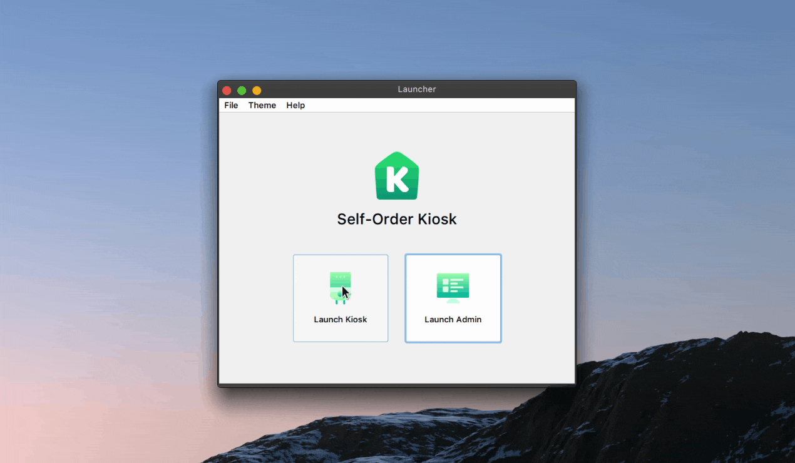

<p align="center">
  
</p>

<h1 align="center">Self-Order Kiosk</h1>

<p align="center">A self-checkout experience where customers can quickly place an order.</p>

<p align="center">
  
</p>

## Features

- 🛒 Place an order
- 🔀 Customize your order
- 🔓 Authenticate admin users
- ✏️ Manage items, categories and users
- 📃 See overview of orders
- 🎨 Light and dark theme support

## Stack

- Java Swing
- [FlatLaf](https://www.formdev.com/flatlaf)
- MySQL
- Maven

## Requirements

- JDK 8
- NetBeans

## Getting Started

1. Follow [these steps](#database) to set up the database.
2. Open the project in NetBeans.
3. Run the build command to download Maven dependencies.
4. Finally, run the project.

## Database

1. Create a MySQL database named **self_order_kiosk**.
2. Run the SQL queries located in the `/migrations` folder.
3. Create a new file named **db.properties** in `/src/main/resources/app`.
4. Enter the following details:

```properties
url=jdbc:mysql://<HOST>:<PORT>/self_order_kiosk?serverTimeZone=UTC
username=<USERNAME>
password=<PASSWORD>
```

**Demo Login**

- Username: krabs
- Password: 123

## Production

1. Open the project in NetBeans.
2. Run the clean and build command.
3. Go to the `/target` folder.
4. Open **self-order-kiosk-VERSION-jar-with-dependencies.jar**.

## Changelog

### [v1.0.0] - 2020-10-30

- New feature to delete orders in admin module
- Fix item price is negative after changing size in customize window
- Fix huge item image preview

### [v0.5.0] - 2020-10-29

- New feature to update ordered item in kiosk
- New feature to show order details in orders window
- New feature to show item ordered price in customize window
- Fix issue where item size is not updating in customize window
- Improve load time of menu window

### [v0.4.0] - 2020-10-28

- New feature to customize item in customize dialog
- New feature where orders will be saved in database
- New items in migration
- Change items in menu window to be populated
- Change order table to be populated

### [v0.3.0] - 2020-10-27

- New authentication feature in login window
- New feature to manage orders in admin module
- New feature to manage categories in admin module
- New feature to manage users in admin module

### [v0.2.0] - 2020-10-04

- New feature to manage items in admin module
- New menubar in launcher window
- New about window
- Theme settings moved to launcher window menubar

### [v0.1.0] - 2020-09-30

- Initial alpha release

## License

[MIT License](LICENSE)

## Credits

Icons made by [Freepik](https://www.flaticon.com/authors/basic-gradient/gradient) from [www.flaticon.com](https://www.flaticon.com)

[v1.0.0]: https://github.com/nerkarso/self-order-kiosk/releases/tag/v1.0.0
[v0.5.0]: https://github.com/nerkarso/self-order-kiosk/releases/tag/v0.5.0
[v0.4.0]: https://github.com/nerkarso/self-order-kiosk/releases/tag/v0.4.0
[v0.3.0]: https://github.com/nerkarso/self-order-kiosk/releases/tag/v0.3.0
[v0.2.0]: https://github.com/nerkarso/self-order-kiosk/releases/tag/v0.2.0
[v0.1.0]: https://github.com/nerkarso/self-order-kiosk/releases/tag/v0.1.0
